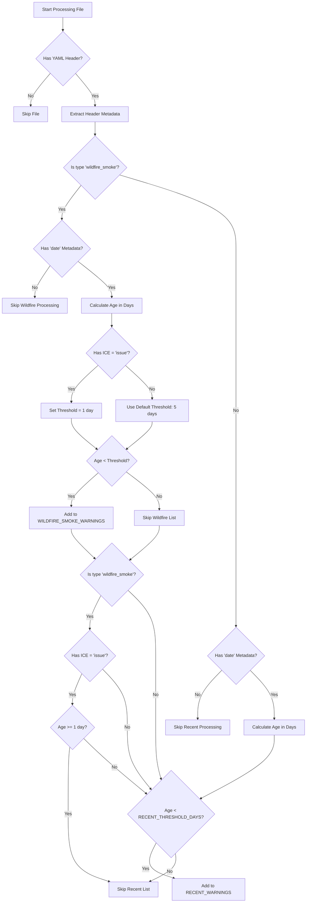

# Warning Selection Logic

This document outlines how warnings are selected for inclusion in the Recent Warnings and Wildfire Smoke Warnings lists by the `construct-lists.py` script.

## Overview

The script processes input files from Quarto's project input files and categorizes them according to two main criteria:

1. **Recent Warnings**: Warnings issued within the past 5 days (configurable via `RECENT_THRESHOLD_DAYS`)
2. **Wildfire Smoke Warnings**: Specifically categorized wildfire smoke advisories with special handling

## Selection Flowchart

## Selection Logic Details

### For Any Warning

1. File is processed if it has a valid YAML header.
2. Essential metadata is extracted (path, title, type, ice, date, location).
3. Processing branches into two separate evaluation paths:
   - Evaluation for Wildfire Smoke Warnings
   - Evaluation for Recent Warnings

### For Wildfire Smoke Warnings

1. The code first checks if the file has `type: wildfire_smoke` metadata.
2. If it does, the code then checks if the file has a `date` metadata field.
3. If a date exists, age is calculated by comparing the warning's date to today's date (in BC timezone).
4. Different thresholds apply:
   - Default: Include if less than 5 days old (`RECENT_THRESHOLD_DAYS`)
   - Special case: For warnings with `ice: issue`, include only if less than 1 day old
5. If the age is less than the applicable threshold, the warning is added to the Wildfire Smoke Warnings list.

### For Recent Warnings

1. All files with a `date` metadata field are considered for the Recent Warnings list.
2. Special handling for wildfire smoke warnings:
   - If it's a wildfire smoke warning with `ice: issue` and is 1+ days old, it's explicitly excluded
   - This is done to prevent older "issue" wildfire smoke warnings from appearing in the recent list
3. Otherwise, any warning less than 5 days old (`RECENT_THRESHOLD_DAYS`) is included in the Recent Warnings list.

## Technical Implementation

The script:
1. Reads input files from `QUARTO_PROJECT_INPUT_FILES` environment variable
2. Extracts YAML headers using regex
3. Applies the selection logic
4. Outputs two YAML files:
   - `_recent_warnings.yaml` for recent warnings
   - `_wildfire.yaml` for wildfire smoke warnings

These output files are then used in custom listings within the Quarto site.
