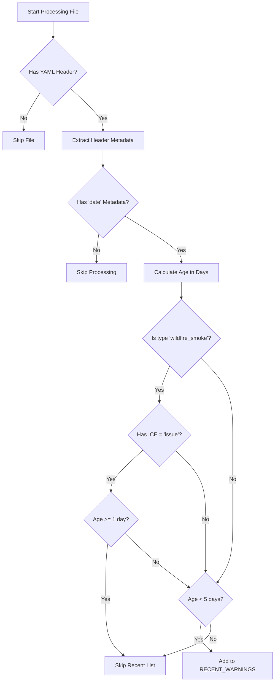

# Front Page Selection Logic

This document outlines how warnings are selected for inclusion on the front page as part of site rendering.

## Overview

The [script](https://github.com/bcgov/aqwarnings/blob/main/frontend/construct_lists.py) processes input files from Quarto's project input files and categorizes them to identify recent warnings:

**Recent Warnings**: Warnings issued within the past 5 days (configurable via `RECENT_THRESHOLD_DAYS`), with special handling for wildfire smoke warnings.

## Business Description

The script:
1. Reads input files from `QUARTO_PROJECT_INPUT_FILES` environment variable
2. Extracts YAML headers using regex
3. Applies the selection logic
4. Outputs a YAML file:
   - `_recent_warnings.yaml` for recent warnings

This output file is then used in custom listings within the Quarto site.

## Selection Flowchart

## Selection Logic Details

### For Any Warning

1. File is processed if it has a valid YAML header.
2. Essential metadata is extracted (path, title, type, ice, date, location).
3. The file is considered for the Recent Warnings list if it has a date.

### For Recent Warnings

1. All files with a `date` metadata field are considered.
2. Special handling for wildfire smoke warnings:
   - If it's a wildfire smoke warning with `ice: issue` and is 1+ days old, it's explicitly excluded
   - This is done to prevent older "issue" wildfire smoke warnings from appearing in the recent list
3. Otherwise, any warning less than 5 days old (`RECENT_THRESHOLD_DAYS`) is included in the Recent Warnings list.
